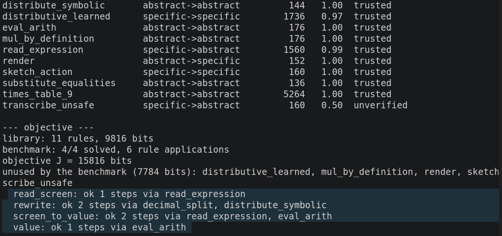
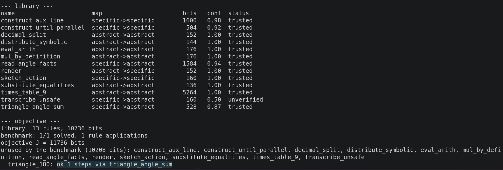

# MathDynamicMultiNets — a Ren machine

An implementation of the non-Turing computer architecture in *"A Non-Turing
Computer Architecture for Artificial Intelligence Forming Multiple Dynamic
Rules and Its Halting Problem"* (Jineng Ren, 2026): two tapes with two
different alphabets, mapping rules between them formed dynamically as neural
networks, an LLM as the controller, and a conciseness objective that decides
which rules are worth keeping.

The base network for a learned rule is
[`DetourNet`](../RL_training/rl_training/detourNet.py) generalised by one
parameter — same two views, same shared encoder, same semantic-palette front
end, same `fa - fb` fusion; the head goes from `num_classes` logits to
`num_slots × num_classes`, and `num_slots == 1` reproduces DetourNet exactly.

```
                     ┌───────────────────────────────┐
   symbols  ────────►│  ABSTRACT tape                │  exact arithmetic,
   "12*30"           │  read/write head              │  rigid definitions,
                     └───────────────┬───────────────┘  formal logic
                                     │
                            ┌────────┴────────┐
                            │   CONTROLLER    │◄── an LLM chooses the next
                            │  (Claude, or a  │    operation from a fixed
                            │  scripted plan) │    instruction set
                            └────────┬────────┘
                                     │
                     ┌───────────────┴───────────────┐
   images   ────────►│  SPECIFIC tape                │  structure as layout,
   (64,384,3)        │  read/write head              │  perception required
                     └───────────────────────────────┘
   the two are connected ONLY by mapping rules:
     abstract→abstract  calculation, algebraic identities, substitution
     abstract→specific  rendering (built in)
     specific→specific  a structural rewrite, learned from experiments
     specific→abstract  reading (learned) — the paper's YOLO step
```

## Install and run

```bash
conda env create -f environment.yml      # python 3.10, numpy, torch+CUDA, pytest
conda activate dynamicmultinet
python -m pytest tests/ -q               # 40 tests, ~3 s

python examples/run_multiplication.py    # experiment 1
python examples/run_geometry.py          # experiment 2
python examples/run_robotics.py          # appendix A
#   add --quick for a 30 s smoke run, --llm to let Claude drive
```

**Rendered images.** Every example ends by writing what it drew to
`renders/<experiment>/`, because an accuracy number over pictures is not
checkable and the pictures are: held-out inputs captioned with what the rule
answered and what the oracle wanted, the drawings a specific→specific rule
produced, the tape cells, and — in the geometry run — the proof replayed one
image per step. Filenames are truncated, so the full captions live next to them
in `index.txt`:

```
renders/geometry/index.txt
  step03_construct_aux_line_triangle0_move_up_mo.png   construct_aux_line_triangle0|move_up|move_up|rotate_cw
  read_angle_facts_02_WRONG_want-no_facts_got-A1.png   WRONG_want-no_facts_got-A1=B1,A2=B2,A1+A3+A2=180
```

Pass `--dump DIR` to put them somewhere else, `--no-dump` to skip them. A
`--quick` run writes the same images from badly trained rules, which is the
fastest way to see what the experiment is doing before paying for a real run.

`requirements.txt` is the pip equivalent if you already have an environment.
Only numpy is strictly required — the tapes, renderer, prior rules, proof
search and the objective all run without torch, and declaring a learned rule
without it fails immediately with an install hint rather than several tool
calls later.

**Device.** Learned rules run on the GPU when there is one — `device=None`
detects, the same convention as `DetourPredictor`. Pass `--device cpu` (or
`RenMachine(device="cpu")`) to pin it, which is worth doing when two runs have
to match exactly: cuDNN kernels do not reproduce CPU kernels bit-for-bit even
under the same seed, so the two devices are different random draws of the same
procedure. Every run prints which device it chose. The speedup is real but
modest — experiment 1 is 2m04s on a 4090 against ~8 min on CPU — because the
nets are small and scene generation, glyph rendering and pixel quantization
stay on the CPU in numpy. On `--quick` runs the two are indistinguishable.

The examples run offline through a `ScriptedController`, which drives *the
identical tool table* an LLM controller uses — a demo without an API key is not
a different program. With `--llm` (needs `ANTHROPIC_API_KEY` or an
`ant auth login` profile) Claude decides what to do next instead.

```bash
python -m dynamicmultinet.cli tools       # the controller's instruction set
python -m dynamicmultinet.cli catalogue   # generators and oracles it may pick
python -m dynamicmultinet.cli run --goal "..." --llm
```

## The objective

Rules "as concise and useful as possible" is a single number, priced as a
two-part code in one currency:

```
J(library) = bits to write the rules down  +  1000 × rule applications needed
                                              to solve the benchmark tasks
```

A rule earns its place when it shortens more derivation than it costs to state.
A learned rule is charged for its **recipe** — generator, oracle, architecture,
seed — not its weights, because the machine can regenerate the weights from the
recipe, so the recipe is the actual description. Three consequences, all of
them behaviours the paper describes:

* a rule nothing uses is deleted (pure first term);
* a recurring six-step chain is worth replacing with one composite or one
  distilled net (six applications cost more than one recipe);
* a net that duplicates a two-symbol identity is not worth keeping at any
  accuracy, because the identity is cheaper to state.

## What the machine can do

Every operation is a tool the controller picks by name; the LLM never writes or
executes code. `python -m dynamicmultinet.cli tools` prints the full list.

| | |
|---|---|
| `generate_data` / `label_data` | run an experiment, then ask an oracle what is true |
| `declare_rule` / `train_rule` | decide what mapping a rule performs, and fit it |
| `verify_rule` / `verify_against_rules` | check on fresh data, against an oracle **or** against a chain of already-trusted rules |
| `grow_ensemble` | train a specialist on what the base rule gets wrong and let it override (paper §3) |
| `compose_rules` / `distill_rule` | name a chain, or collapse it into one net |
| `prove` / `prove_from_tape` / `keep_proof` | search for a rule chain; keep the one you find |
| `library_report` / `simplify_library` | price the library; drop what stopped paying |
| `halting_budget` | a search budget with a stated error rate (paper §5) |

**Only trusted rules may appear in a proof**, and trust comes from verification
on data the rule was not trained on. The strength of the evidence is tracked,
not just the accuracy:

| grounding | worth | what it means |
|---|---|---|
| `definitional` | 1.0 | bottoms out in a definition (multiplication as repeated addition) |
| `independent_chain` | 0.95 | a route sharing no rule and no teacher with what it checks |
| `measured` | 0.9 | came from outside (collision geometry) |
| `derived` / `rule_chain` | 0.7 | inherits the errors of the rules it used |
| `constructed` | 0.2 | the machine checked its own handwriting |

`independent_chain` is the interesting one, because grounding is a property of
the *pair*, not of the reference alone. Two routes that share no rule and no
training oracle cannot agree on the same *wrong* answer except by coincidence,
and `verify.collision_probability` measures how likely that coincidence is from
the reference's own answers: rewriting `37*32` into a sixteen-character
expression collides at 0.0001, so agreement is confirmation rather than
evidence, and the reported accuracy becomes a **lower bound** — disagreements
are unattributed, since an unrelated reference is exactly the kind that can be
wrong by itself. The same argument is worthless for a rule choosing one of four
actions, where a quarter of agreements are luck, so the test is measured rather
than assumed. The converse guard matters more: a reference that *runs* the rule
under test scores a perfect 1.000 and means nothing, so it is refused outright.

Trust is also what stops `simplify_library` from optimising the architecture
away. Two rules that agree on a probe set are candidates for merging, but
`transcribe_unsafe` agrees with a *real* reader on every cell the machine drew
itself — it copies the caption — and costs a tenth as many bits. Dropping the
reader in its favour would leave a machine that cannot read an observed cell at
all, and the bit count cannot see that. So a rule is never displaced by one the
machine trusts less, and every applied drop is re-priced on its own and put back
if the benchmark loses a task.

Confidence multiplies along a chain, so ten steps at 0.99 is a 0.90 proof —
the reason `verify_rule` defaults to a 0.99 threshold rather than something
that "looks fine".

## Results

Default settings, single runs, no cherry-picking. Times are on one RTX 4090
(2m04s for experiment 1, 4m01s for experiment 2, 4m15s for appendix A); the
same runs on CPU take a few times longer and land in the same place.

**Experiment 1 — the distributive rule** (`run_multiplication.py`)



```
--- objective ---
library: 11 rules, 9816 bits
benchmark: 4/4 solved, 6 rule applications
objective J = 15816 bits
  read_screen:      ok 1 steps via read_expression
  rewrite:          ok 2 steps via decimal_split, distribute_symbolic
  screen_to_value:  ok 2 steps via read_expression, eval_arith
  value:            ok 1 steps via eval_arith
```

| rule | holdout | fresh data | trusted |
|---|---|---|---|
| `read_expression` (specific→abstract) | 0.990 | **0.9867** (150 checks) | yes |
| `distributive_learned` (specific→specific) | 0.983 | **0.9609** (230 checks) | yes |

The learned rewrite was checked twice on the same fresh set: **0.9609** against
the oracle, and **0.9609** against the independent chain
`read_expression → decimal_split → distribute_symbolic → render`. Two routes
that share no machinery agreeing to four digits is what verification is for.

All four benchmark tasks solved, `J = 15816 bits` over 11 rules and 6 rule
applications, including `'12*30' (drawn, unlabelled) → '360'` in two steps at
confidence **0.9803** — a chain that leaves the specific domain and comes back.
Unlike the construction loop in experiment 2, nothing here is applied to its
own output more than once, so the chain is two links long and the reader's
0.9867 is most of what the confidence is made of.

Then the objective does something worth noticing: the learned distributive rule
is verified and trusted, and still reported **unused**. Going through the
picture costs two extra domain crossings to reproduce an identity the machine
already had, so `simplify_library` proposes dropping it — while keeping the
reader, which has no symbolic substitute. The rule is not wrong; it just does
not pay for itself. That is the conciseness objective doing its job, and it is
left in the example rather than tuned away.

The `grow_ensemble` step usually **discards** its specialist here, and says so:
in this run it mined 55 hard cases, trained on them, measured base 0.985 →
ensemble 0.960 on 454 held-out examples, and left the base rule alone. §3's
construction is treated as a claim to be checked, not an assumption.

**Experiment 2 — interior angles of a triangle** (`run_geometry.py`)



```
--- objective ---
library: 13 rules, 10736 bits
benchmark: 1/1 solved, 1 rule applications
objective J = 11736 bits
  triangle_180: ok 1 steps via triangle_angle_sum
```

Two learned rules of different kinds: `construct_aux_line` looks at the drawing
and *edits* it (output is another drawing, so it can be applied again — the
construction loop is proof search inside the specific domain), and
`read_angle_facts` says what the finished figure licenses. `iterate_rule` then
folds the loop into `construct_until_parallel`, which runs the constructor to
its own stopping point and keeps whichever drawing the reader most calls the
proof configuration — so a wrong step costs a candidate rather than the proof.
From a drawing whose auxiliary line starts off the apex and at the wrong angle:

```
PROVED: 'triangle0' => 'B1+A3+B2=180'   (3 steps, confidence 0.877)
  --construct_until_parallel [spec->spec]-->  triangle0|move_up|move_up|rotate_cw x5
  --read_angle_facts        [spec->abst]-->  'A1=B1,A2=B2,A1+A3+A2=180'
  --substitute_equalities   [abst->abst]-->  'B1+A3+B2=180'
```

Confidence is the product along the chain, so a rule that is merely *above
threshold* is not good enough to be applied six times: six links at 0.95 is
0.74 before the reader is even consulted. That is the conclusions' 0.99999¹⁰⁰⁰
argument seen from the wrong end, and it is why this example trains to
convergence rather than to "verified".

Underneath sat a gap verification could not see, and it is worth reading as the
cautionary result of the repository. A specific→specific rule is applied to its
own outputs, so a held-out set of generated *inputs* is the weaker of the two
checks available. The construction moves the line in steps of 0.12 and rotates
it in steps of 0.15, into tolerances of 0.06 and 0.12 — it therefore finishes
*near* the proof configuration and essentially never *on* it, while
`triangle_scenes` drew nothing but the exact configuration. Probed directly,
`read_angle_facts` called an exactly parallel line correct 40 times out of 40
and the line its own construction produces 21 times out of 40. A rule
verifying at **0.995** that cannot recognise a finished proof — and the search
duly reported "space exhausted" after eleven nodes while every rule in the
table read as trusted.

The repair takes two halves that do nothing apart: the policy now stops once
another rotation would not get *closer* rather than the instant the tolerance
is met, and the generator draws solved scenes across exactly that landing zone.
Changing only the policy leaves every training label identical, because no
generated scene lies in the window it affects; changing only the generator, if
it fills the whole tolerance band, restores the proof and triples the rate of
proofs licensed on unfinished constructions, because positives at 0.119 and
negatives at 0.121 are the same picture with opposite labels.

`keep_proof` then stores the whole thing as one rule — `triangle_angle_sum`,
specific→abstract at 0.87 — and the benchmark drops to a single rule
application, which is the `1/1 solved, 1 rule applications` in the screenshot
above. The proof is replayed image by image into
`renders/geometry/` (see below), which is the only way to check that the
auxiliary line really did end up through the apex and parallel to the opposite
edge.

**Appendix A — sketch to escape direction** (`run_robotics.py`)

`RuleNet(num_classes=7, num_slots=1)` — DetourNet with a smaller action set —
on 6000 generated sketches, verified against the collision geometry on 290
fresh ones:

```
top-1 0.683    top-3 0.883    'direct' 142/144
```

Top-3 is the operational number, for the reason `detourNet.evaluate` gives:
the planner walks the ranked candidates and takes the first one a collision
check clears. `direct` — the class whose failure drives the arm into an
obstacle — is at **0.986**; the six detour classes are what the other 0.32
is made of, and they sit between 0.36 and 0.50.

This is the one experiment where training to convergence does **not** rescue
the rule. At 1500 sketches it scored 0.72 on its holdout and 0.603 on fresh
scenes; that 0.12 gap is a rule short of data, and 6000 sketches close it —
0.696 and 0.683, within a point of each other, top-3 up from 0.800 to 0.883.
What is left is not overfitting but the task: picking one of six detours from
a sketch is genuinely harder than deciding whether the path is blocked at all,
which is the part the net does learn. So the rule stays **below its own 0.85
threshold and is never trusted**, and the machine will not let it into a
proof. That is the intended behaviour of `verify_rule`, and it is the reason
this appendix reports a ranking rather than a chain.

## Layout

```
dynamicmultinet/
  tapes.py       the two tapes, their alphabets, and the head operations
  render.py      abstract → pixels: the built-in write function (no font files,
                 no image library — exact palette colours, byte-reproducible)
  palette.py     semantic classes; colour means what a thing IS
  nets.py        RuleNet — DetourNet with a slot head
  codec.py       how a rule sees a cell and what its logits mean
  rules.py       Python / Table / Neural / Composite / Ensemble rules + library
  prior.py       what the machine already knows (exact, symbolic)
  generators.py  experiments it can run          } a closed registry: the LLM
  oracles.py     what is true, and how strongly   } picks by name, never by code
  train.py       fitting a rule; hard-case mining; specialists
  verify.py      trust, grounding strength, counterexamples
  proof.py       best-first search over rule chains, across domains
  compose.py     composition, distillation, the objective J, simplification
  halting.py     the statistical anytime algorithm (§5)
  machine.py     RenMachine: state + operations
  tools.py       the controller's instruction set
  controller.py  LLM controller and its offline twin
```

## Notes on faithfulness

Things implemented as described, and things where a choice had to be made:

* **The specific tape really is opaque.** A cell holds pixels; `Content.text`
  is provenance for logging and for supervising a reader. `transcribe_unsafe`
  (copy the caption) exists as a baseline, is never trusted, and *declines
  cells marked as observed* — otherwise every perception task would be solvable
  by reading the machine's own handwriting. Benchmark tasks that matter use
  observed cells.
* **The distributive rule is discovered, not asserted.** Its oracle checks each
  instance numerically before emitting it, and rejects any that does not hold.
* **A rule must be trained where it will be USED, and the geometry run is a
  case study in what happens otherwise.** The construction moves the auxiliary
  line in steps of 0.12 and rotates it in steps of 0.15, into tolerances of
  0.06 and 0.12 — so it can never finish on the exact configuration, and
  `triangle_scenes` drew nothing else. Measured, the reader called an exactly
  parallel line correct 40 times out of 40 and the line its own construction
  actually produces 21 times out of 40. That is a rule verifying at 0.995 which
  cannot recognise a finished proof, and it left `triangle_180` unproved with
  the search reporting "space exhausted" after eleven nodes. Verification could
  not see it: it draws from the same generator. The fix is in two halves that
  only work together — the policy stops once another move would not get closer
  rather than the instant the tolerance is met, and the generator draws solved
  scenes across exactly that landing zone, staying clear of the 0.12 boundary
  so no two near-identical drawings carry opposite labels.
* **A found proof is still not automatically a sound one.** Replaying each
  proof and asking the oracle whether the drawing it ends on genuinely licenses
  the angle facts, a real fraction is not, and those proofs terminate, cross
  domains and report a confidence like any other. Over 120 triangles the fix
  above takes the benchmark scene from unproved to a genuine three-step proof
  and removes every outright failure (14 scenes with no proof, now none), at
  92 genuine proofs against 95 before — but the unsound ones go from 11 to 28,
  because a reader that accepts a range of finished constructions accepts more
  of everything. Widening the search is worse still (see `proof.search`'s
  `beam`), and folding the loop into `iterate_rule` shortens the proof from
  eight steps to three without helping soundness, since the rule choosing among
  candidate drawings is the same reader that misjudges them — selection cannot
  repair its own judge. A benchmark counts a task solved on `proof.found`
  alone, so `library_report` prices these in. Auditing the final cell against
  something independent of the reader is the fix, and it is not implemented.
* **§3's base-plus-specialists construction is checked, not assumed.** The
  specialist is mined from one slice and the ensemble is judged on another; if
  it does not beat the base on held-out data, it is discarded and the base is
  left alone. In the robotics run it usually is discarded, which is information.
  Mine from a set the base did NOT train on: run it over its own training data
  and a rule that verifies at 0.61 on fresh scenes can show zero failures, so
  the construction silently does nothing. `grow_ensemble` compares the mined
  failure rate against what verification measured and says which case it hit,
  rather than reporting "no hard cases" either way.
* **§5's algorithm** computes `N = ⌈ln(1/δ)/(2λ²)⌉` and
  `k = ⌈N(1-ε+λ)/(1-2Nσ(1-ε))⌉`, and refuses when σ is not
  `o(min(1/t₍N₎, 1/N²))` rather than returning a threshold whose guarantee does
  not hold. Running time is measured in rule applications, so it calibrates a
  real search budget. N is capped: the formula grows as 1/λ², so λ=1e-4 asks
  for 150 million sampled programs, and an uncapped N turns a tightened
  parameter into a hang. When the cap binds, the calibration reports the λ the
  sample really buys rather than the one requested — capping the cost must not
  inflate the claim. `halting_budget` fits λ to however many proofs exist
  instead of demanding 3745 of them for a fixed λ=0.02, which no library has.
* **Image-to-image generation is not a generative model here.** Figure 3's
  "move the line up / rotate it" is a *sketch-space update*: the decision is
  learned perception, the update is arithmetic on scene parameters, and the
  output is a redrawn cell. The paper allows exactly this ("a generative model
  **or a sketch space updating module**").
* **The controller cannot execute code.** Generators and oracles are a closed
  registry chosen by name. This is a deliberate narrowing: it costs nothing the
  paper's experiments need, and an LLM with an `exec()` would add a failure mode
  the architecture does not call for.
